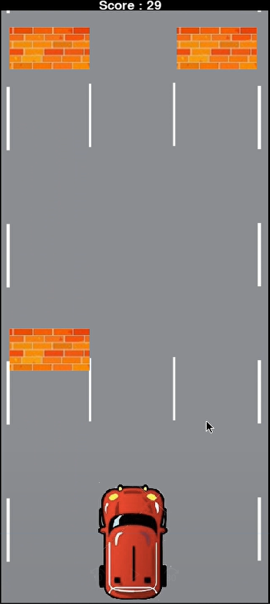

Here is a little game created in python using pygame by Gauthier Verdoolaeghe and myself Vivien Touvier

### Installation

You have to install [Python](https://www.python.org/downloads/)

### Dependencies

Install dependencies:

```
py -m pip install -U pygame --user
```

### Download project

First clone this repository on your computer:

```
git clone https://github.com/vivientouvier/Jeu.git
```

Move to the containing folder

```
cd Jeu
```

### Play

```
py Jeu.py
```

### Preview


